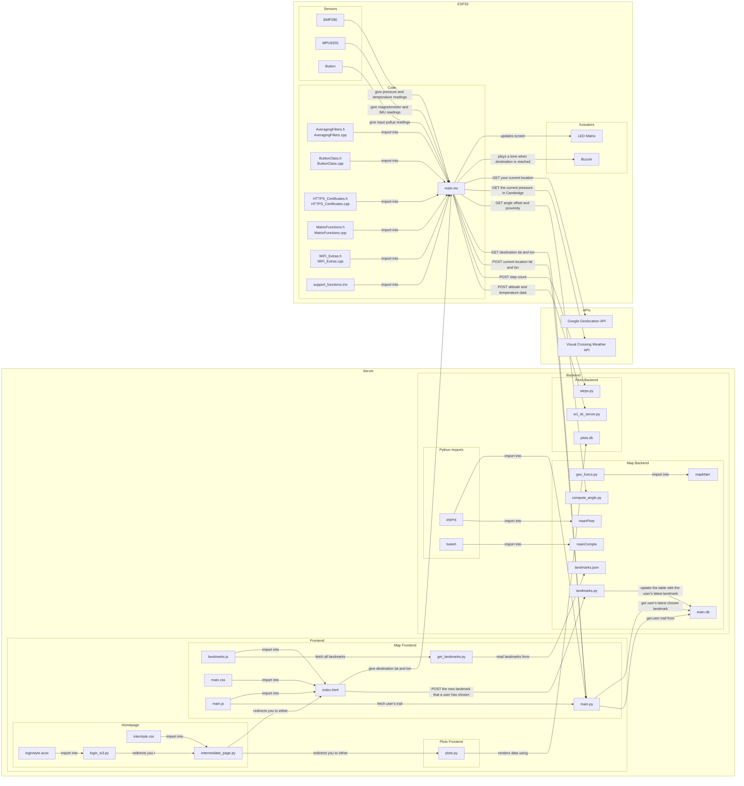

```mermaid
flowchart LR
    subgraph APIs
        weatherAPI[Visual Crossing Weather API]
        geolocationAPI[Google Geolocation API]
    end

    subgraph Server
        subgraph Frontend

            subgraph Homepage
                homeLogin[login_w3.py]
                homeIntermediate[intermediate_page.py]

                homeLoginCSS[loginstyle.acss]
                homeInterCSS[interstyle.css]

                homeLoginCSS -- import into --> homeLogin
                homeInterCSS -- import into --> homeIntermediate

                homeLogin -- redirects you to--> homeIntermediate
            end

            subgraph Map Frontend
                mapFrontMain[index.html]

                mapFrontLandmarksJS[landmarks.js]
                mapFrontCSS[main.css]
                mapFrontMainJS[main.js]


                mapFrontLandmarksJS -- fetch all landmarks --> mapGetLandmarks
                mapFrontMainJS -- fetch user's trail --> mapMain

                mapFrontLandmarksJS & mapFrontCSS & mapFrontMainJS -- import into --> mapFrontMain

            end

            subgraph Plots Frontend
                plotsMain[plots.py]
                
            end

            homeIntermediate -- redirects you to either --> plotsMain & mapFrontMain


        end

        subgraph Backend

            subgraph Python Imports
                import1[pyproj]
                import2[bokeh]
            end
            
            subgraph Map Backend
                mapMain[main.py]
                mapGeofuncs[geo_funcs.py]
                mapGetComputeAngle[compute_angle.py]
                mapGetLandmarks[get_landmarks.py]
                mapLandmarksPy[landmarks.py]
                mapLandmarksJson[landmarks.json]

                mapDatabase[main.db]

                mapFrontMain -- POST the new landmark that a user has chosen -->mapLandmarksPy
            
                mapLandmarksPy -- update the table with the user's latest landmark --> mapDatabase

                mapMain -- get user trail from --> mapDatabase

                mapMain -- get user's latest chosen landmark --> mapDatabase

                mapGeofuncs -- import into --> mapMain`


                mapGetLandmarks[get_landmarks.py] -- read landmarks from --> mapLandmarksJson

                mapDatabase[main.db]

                import1 -- import into --> mainPlots & mapMain

                 import2 -- import into --> mainCompte
            end


            subgraph Plots Backend
                plotsSteps[steps.py]
                plotsDynamicData[w1_sk_server.py]

                plotsDatabase[plots.db]
                plotsMain -- renders data using --> plotsDatabase
            end
        end


    end

    subgraph ESP32
        subgraph Code

            AveragingFilters[AveragingFilters.h <br> AveragingFilters.cpp]
            ButtonClass[ButtonClass.h <br> ButtonClass.cpp]
            HTTPS_Certificates[HTTPS_Certificates.h <br> HTTPS_Certificates.cpp]
            MatrixFunctions[MatrixFunctions.h <br> MatrixFunctions.cpp]
            WiFi_Extras[WiFi_Extras.h <br> WiFi_Extras.cpp]
            support_functions[support_functions.ino]

            mainESP[main.ino]            
            
            AveragingFilters & ButtonClass & HTTPS_Certificates & MatrixFunctions & WiFi_Extras & support_functions -- import into --> mainESP


            mainESP -- POST altitude and temperature data --> plotsDynamicData
            mainESP -- POST step count --> plotsSteps

            mainESP -- POST current location lat and lon --> mapMain

            mainESP -- GET destination lat and lon --> mapMain
            mainESP -- GET angle offset and proximity --> mapGetComputeAngle
            mainESP -- GET the current pressure in Cambridge --> weatherAPI
            mainESP -- GET your current location --> geolocationAPI

            mapFrontMain -- give destination lat and lon --> mainESP
        end 


        subgraph Sensors
            sensor1[BMP280]
            sensor2[MPU9255]
            sensor3[Button]
            
            sensor1 -- give pressure and temperature readings --> mainESP
            sensor2 -- give magnetometer and IMU readings --> mainESP
            sensor3 -- give input pullup readings --> mainESP
        end

        subgraph Actuators
            actuator1[Buzzer]
            actuator2[LED Matrix]

            mainESP -- plays a tone when destination is reached --> actuator1
            mainESP -- updates screen --> actuator2
        end
        
    end

```