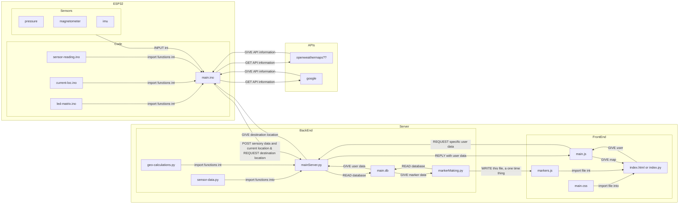

```mermaid
flowchart LR

    subgraph Server
        subgraph FrontEnd

            mainFront[index.html or index.py] 
            mainCSS[main.css]
            mainJS[main.js]
            markerJS[markers.js]
            
            mainFront -- GIVE user--> mainJS
            mainCSS -- import file into --> mainFront
            markerJS --import file into--> mainFront
            mainJS --GIVE map --> mainFront
        end

        subgraph BackEnd
            mainServer[mainServer.py]
            markerMaking[markerMaking.py]
            graphGen[sensor-data.py]
            data[main.db]
            geoCalc[geo-calculations.py]


            graphGen -- import functions into --> mainServer
            mainServer -- REPLY with user data --> mainJS

            mainJS -- REQUEST specific user data ---> mainServer

            mainServer -- READ database --> data
            data -- GIVE user data --> mainServer
            
            markerMaking-- READ database --> data
            data -- GIVE marker data --> markerMaking

            markerMaking -- WRITE this file, a one time thing--> markerJS

            geoCalc --import functions into--> mainServer
        end
    end

    subgraph APIs
        weather[openweathermaps??]
        google_geolocation[google]
    end

    subgraph ESP32
        subgraph Code
            mainESP[main.ino]
            led[led-matrix.ino]
            sensors[sensor-reading.ino]
            loc[current-loc.ino] 


            mainESP -- POST sensory data and current location & REQUEST destination location --> mainServer
            led & loc & sensors--import functions into--> mainESP

            mainServer -- GIVE destination location --> mainESP
            
            mainESP -- GET API information --> weather & google_geolocation
            weather & google_geolocation -- GIVE API information --> mainESP

        end 

        subgraph Sensors
            sensor1[pressure] 
            sensor2[magnetometer]
            sensor3[imu]
        end

        Sensors --INPUT into--> mainESP
        
end
```

Note, the following FSM only concerns the "flow of information". The specifics for hardware are described elsewhere.